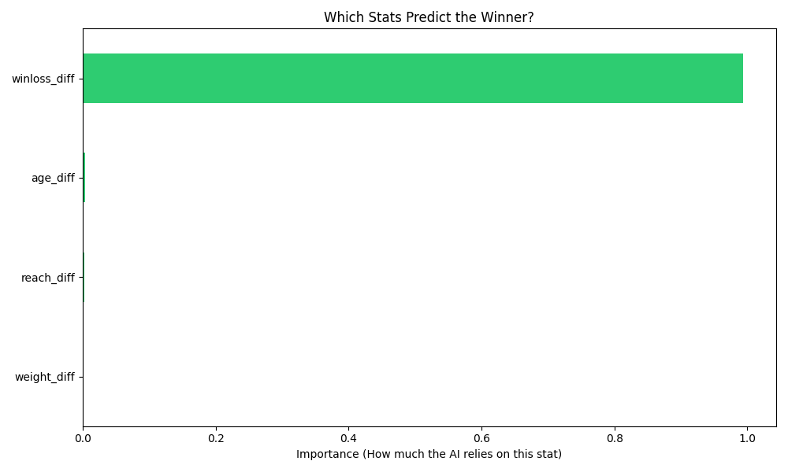

# UFC Fight Outcome Predictor & Simulation

A machine learning pipeline built to analyze fighter statistics and predict match outcomes using a Random Forest architecture. 

## 🚀 Overview
This project simulates 5,000 unique fight matchups based on a dataset of over 4,100 professional fighters. By calculating physical and performance differentials, the model identifies the primary statistical drivers of a victory.

## 📊 Model Logic & Features
Instead of looking at raw stats, the model focuses on **Differentials** (the gap between two fighters). Key features include:
* **Win/Loss Differential:** Career momentum and experience.
* **Reach Advantage:** Physical leverage and distance management.
* **Age Gap:** The impact of athletic prime vs. veteran experience.
* **Weight Class Consistency:** Ensuring fair physical comparisons.

## 📈 Key Insights (Feature Importance)
The model automatically evaluates which statistics most heavily influence the "Winner" label.

## 🛠️ Technical Stack
* **Language:** Python 3.x
* **Libraries:** Pandas (Data Cleaning), Scikit-Learn (Machine Learning), Matplotlib (Visualization)
* **Model:** Random Forest Classifier (100 Estimators)

## 🧬 Mathematical Foundation
This project utilizes **Random Forest** logic, which reduces variance through feature bagging. By calculating the **Gini Impurity** at each node split, the model determines which features provide the most "Information Gain" regarding the fight outcome.
